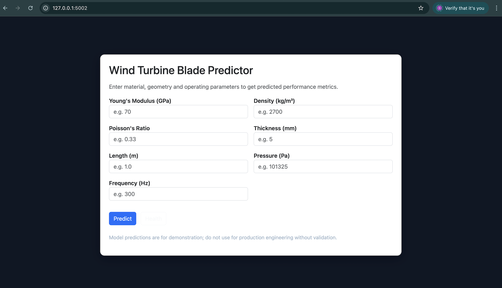
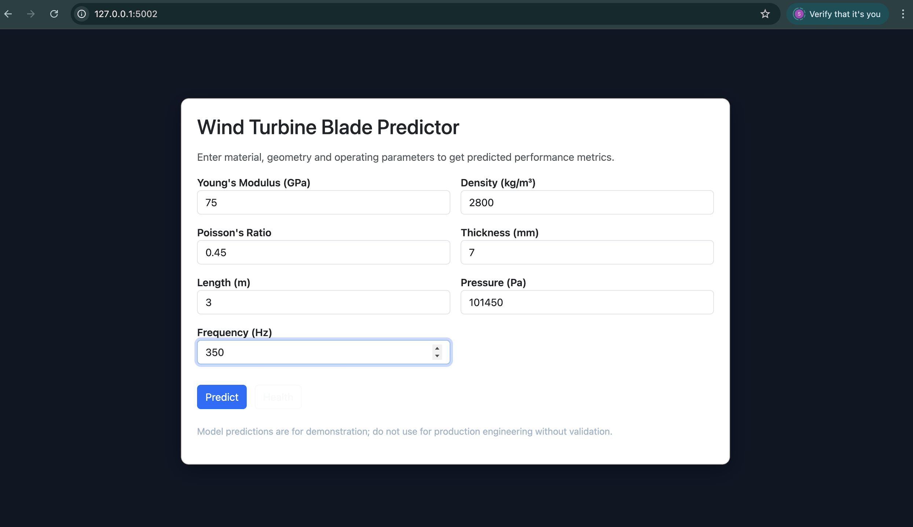
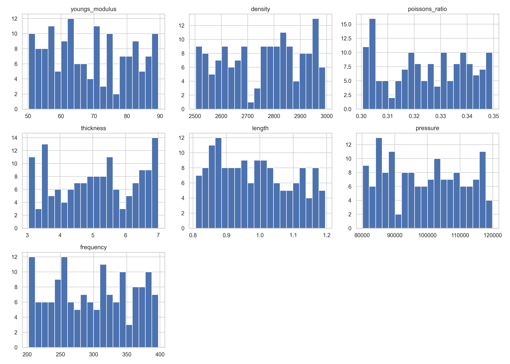
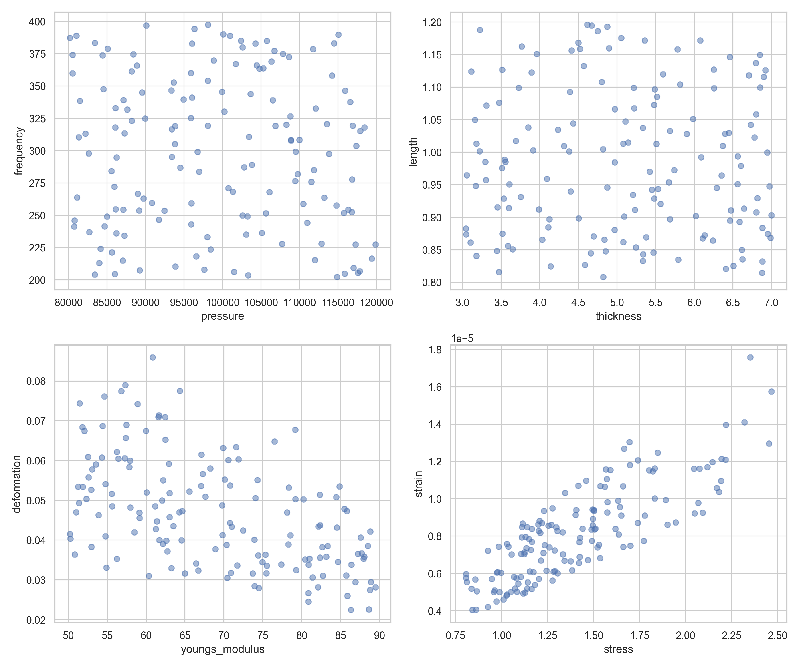
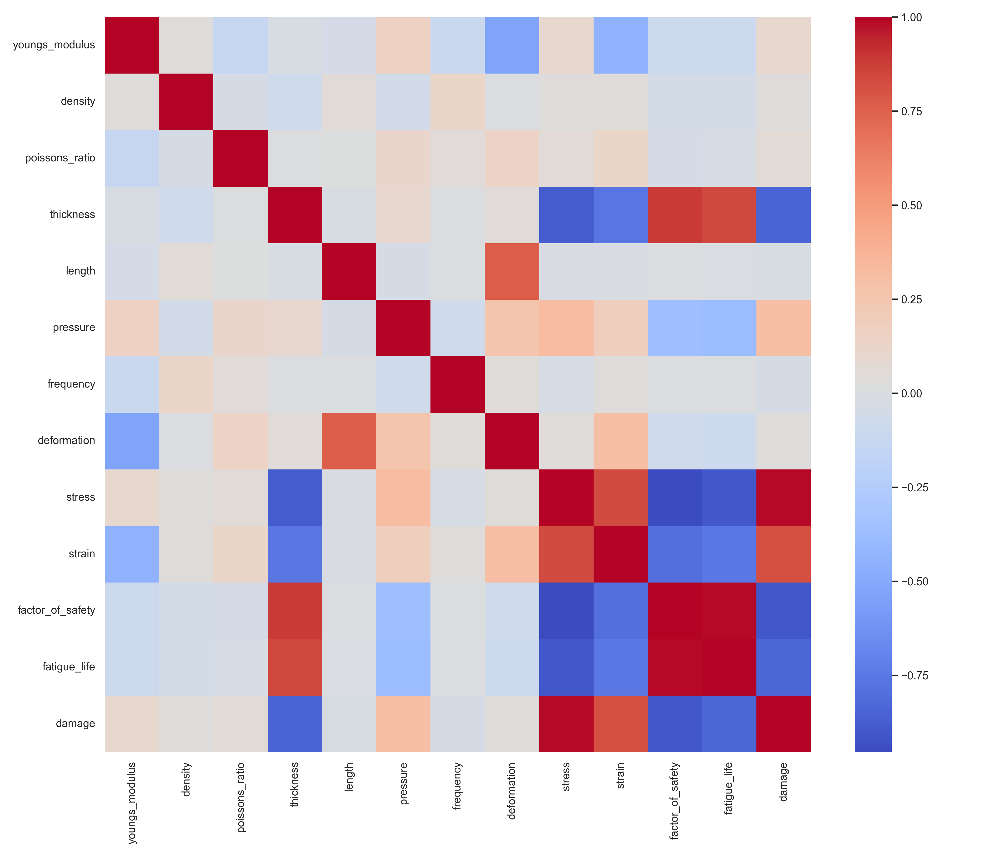
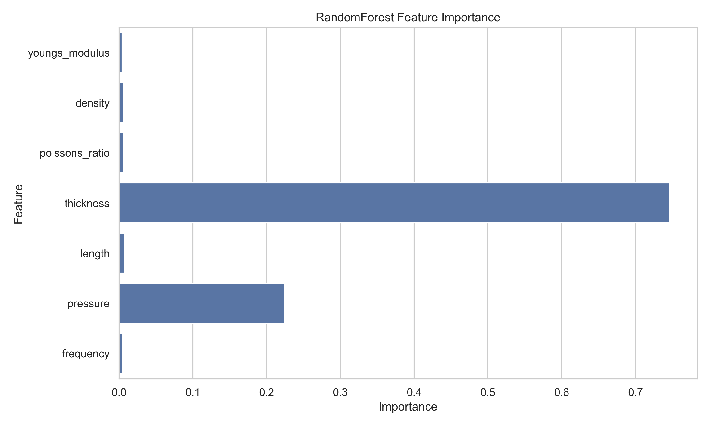
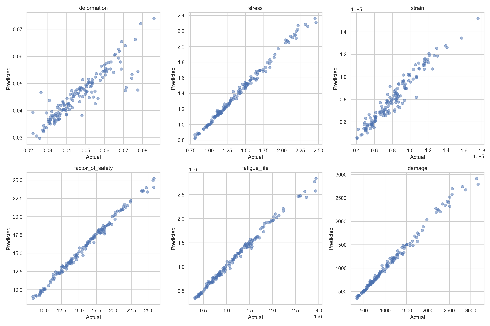
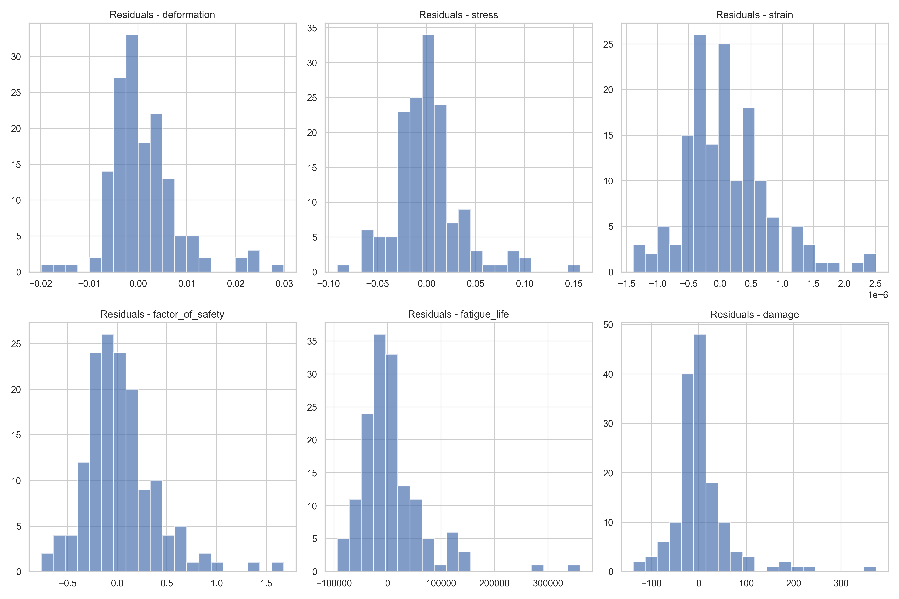

# Wind Turbine Blade Optimization Using Machine Learning

<h1 align="center">🌬️ Wind Turbine Blade Optimization</h1>
<p align="center">
  Machine Learning + Flask Web App for predicting and optimizing wind turbine blade performance.  
</p>
<p align="center">
  
</p>

<p align="center">
  <!-- Status -->
  <a href="https://windturbinebladeoptimization.onrender.com">
    
  </a>

  <!-- Python -->
  

  <!-- License -->
  <a href="./LICENSE">
    
  </a>

  <!-- Build (GitHub Actions) -->
  <a href="https://github.com/TheComputationalCore/WindTurbineBladeOptimization/actions">
    
  </a>

  <!-- Code Style -->
  

  <!-- Model -->
  

  <!-- Issues -->
  <a href="https://github.com/TheComputationalCore/WindTurbineBladeOptimization/issues">
    
  </a>

  <!-- Stars -->
  
</p>


## 🌬️ Overview
This project presents a complete machine-learning–driven pipeline for **wind turbine blade structural behavior prediction and optimization**.  
It combines **synthetic dataset generation**, **Random Forest regression modeling**, **interactive Flask-based prediction dashboard**, and **comprehensive visualization reports**.  

The goal is to help researchers, engineers, and digital twin developers simulate how turbine blade materials and geometry respond to load, pressure, vibration, and fatigue.

---

## 🚀 Features

### ✔ End-to-end ML pipeline
- Synthetic dataset generation
- Data preprocessing
- Model training and evaluation
- Model serialization using `joblib`

### ✔ Flask web application
- Interactive input form  
- Real-time predictions for:
  - Deformation  
  - Stress  
  - Strain  
  - Factor of safety  
  - Fatigue life  
  - Damage index  

### ✔ Scientific Visualization Suite
- Input distribution plots  
- Correlation heatmaps  
- Scatter relationships  
- Model feature importance (Tree-based)  
- Actual vs Predicted curves  
- Residual analysis  
- Engineering relationship plots  

All charts saved under `/reports/figures`.

### ✔ Fully Modular Architecture
- `src/windturbine/data` → dataset generation  
- `src/windturbine/model` → ML model training  
- `src/windturbine/app` → web app  
- `src/windturbine/visualization` → plotting suite  
- `docs/` → reports & documentation  
- `assets/` → screenshots, extracted images  

---

## 🧰 Tech Stack

| Layer | Technology |
|------|------------|
| **Backend** | Python 3, Flask |
| **Machine Learning** | Scikit-Learn, NumPy, Pandas |
| **Visualization** | Matplotlib, Seaborn |
| **Deployment** | Render.com |
| **Packaging** | `joblib`, modular Python architecture |
| **Version Control** | Git + GitHub |

---

## 🌐 Live Deployment

The full web application is deployed at:

👉 **https://windturbinebladeoptimization.onrender.com**

---

## 📁 Project Structure

```
WindTurbineBladeOptimization/
│
├── assets/                     # screenshots & extracted PPT images
├── docs/
│   └── TECHNICAL_REPORT.md     # full engineering & ML report
│
├── reports/
│   └── figures/                # generated plots
│
├── src/
│   └── windturbine/
│       ├── data_generation.py
│       ├── train.py
│       ├── app.py
│       └── visualization.py
│
├── tests/                      # full CI test suite
│
├── synthetic_data/             # generated datasets
├── models/                     # saved ML models
├── README.md
└── LICENSE
```

---

## 📸 Screenshots

### 🏠 Dashboard  


### 🔢 Input Form  


### 📊 Prediction Output  


---

## 📊 Example Generated Plots

Plots are auto-generated under `/reports/figures`.  
Include:

### Input distributions  


### Scatter relationships  


### Correlation heatmap  


### Feature importance  


### Actual vs Predicted  


### Residual histograms  

---

## 🧪 Running Locally

### 1️⃣ Create & activate virtual env
```bash
python3 -m venv .venv
source .venv/bin/activate
```

### 2️⃣ Install dependencies
```bash
pip install -r requirements.txt
```

### 3️⃣ Generate synthetic dataset
```bash
python -m src.windturbine.data_generation --n 5000 --seed 42
```

### 4️⃣ Train the model
```bash
python -m src.windturbine.train
```

### 5️⃣ Run visualization suite
```bash
python -m src.windturbine.visualization
```

### 6️⃣ Start the web app
```bash
python -m src.windturbine.app
```

---

## 🧪 Tests (CI-friendly)

```bash
pytest -q
```

---

## 👤 Author

**Dinesh Chandra — TheComputationalCore**

- GitHub: https://github.com/TheComputationalCore  
- YouTube: https://www.youtube.com/@TheComputationalCore  
- Passion: AI × Simulation × Digital Twins × Computational Engineering  

---

## 📜 License

This project is open-source under the **MIT License**.

---

## ⭐ Acknowledgements

This work is inspired by real-world engineering analysis, structural mechanics, and data-driven digital twin methodologies.

If you like this project, consider ⭐ starring the repo!

